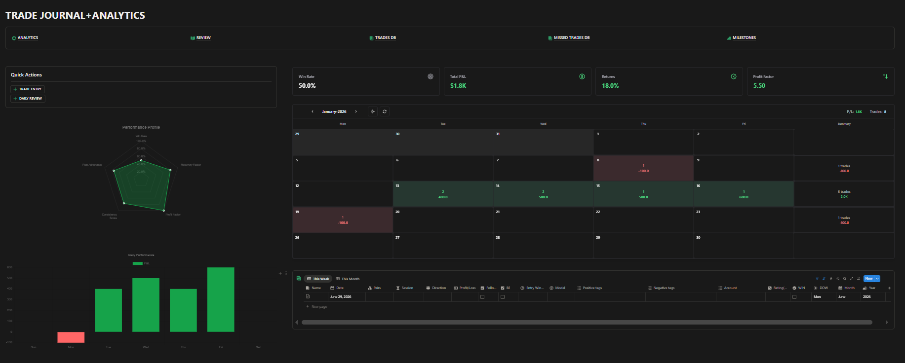

# Trade Journal + Analytics

A premium, dark-mode, **local-first** trading journal and analytics dashboard.
No backend, no account, no external database — your data never leaves the browser.
Built as a static site, deployable for free on GitHub Pages.



## Features

- **Analytics dashboard** — KPI cards, performance radar, daily-performance bars, monthly P&L calendar heatmap with weekly summaries, recent trades.
- **Trades DB** — full table with every field, add/edit/delete, filters (date, pair, account, result), global search, column sorting, JSON/CSV export, JSON import.
- **Trade detail** — mental state (pre/during/post), customizable rule checklist, setup analysis & outcome with image uploads.
- **Daily Review**, **Missed Trades DB**, **Milestones** with progress bars.
- **Local persistence** via IndexedDB (Dexie). Images stored as base64 inside IndexedDB and survive refresh.
- **Import / Export** the whole journal as JSON; export trades as CSV.

## Tech stack

Vite · React · TypeScript · Tailwind CSS · Recharts · lucide-react · Dexie (IndexedDB) · date-fns.

## Getting started

```bash
npm install
npm run dev      # http://localhost:5173
```

## Build

```bash
npm run build    # type-checks then builds to dist/
npm run preview  # serve the production build locally
```

`vite.config.ts` sets `base: "./"` so the build works under any GitHub Pages subpath.

## Deploy to GitHub Pages

1. Push this repo to GitHub (branch `main`).
2. Repo **Settings → Pages → Build and deployment → Source: GitHub Actions**.
3. The workflow at `.github/workflows/deploy.yml` builds and publishes `dist/` on every push to `main`.

## Local storage

All data lives in your browser's **IndexedDB** (database `trade-journal`) via Dexie:
tables `trades`, `reviews`, `missedTrades`, `milestones`, `settings`.
Clearing browser data / site data wipes the journal — use **Export JSON** for backups.

A small **demo dataset** is seeded on first launch only; it never overwrites your data
afterwards. Use **Settings → Reset demo data** to add it back, or **Clear all data** to wipe.

## Import / Export

- **Export JSON** — full backup (all tables) as a single file.
- **Import JSON** — merges a backup back in (by id).
- **Export CSV** — trades only, for spreadsheets.

## Settings

- **Starting balance** (default `10000`) drives the Returns % calculation.

## Known limitations

- Single-device: data is per-browser, not synced. Move it with JSON export/import.
- Images are base64 in IndexedDB; very large screenshots inflate storage.
- `Consistency Score` and `Recovery Factor` are simplified, transparent heuristics
  (see `src/lib/analytics.ts`), not industry-standard definitions.
- No multi-user / auth by design.
